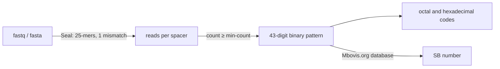

# How it works

## Spoligotyping
The direct repeat (DR) locus of *M. tuberculosis* complex genomes is made of 36 bp direct repeats separated by
unique spacer sequences. Strains differ by which spacers they have lost. Spoligotyping (spacer oligonucleotide
typing, [Kamerbeek *et al.* 1997](https://doi.org/10.1128/jcm.35.4.907-914.1997)) records the presence or absence of
43 reference spacers as a 43-digit binary pattern. Because it was done by hybridization for decades, large
databases of patterns exist, and spoligotyping remains a common first-line genotyping method, notably for
*M. bovis*.

*In silico* spoligotyping looks for the same 43 spacer sequences in whole genome sequencing data, so the results can
be compared with historical spoligotyping data.

## Steps

1. **Spacer detection.** [Seal](https://sourceforge.net/projects/bbmap/) (BBTools) counts the reads (or contigs)
   that contain each spacer. The spacers are 25 bp long, so each spacer is searched as a single 25-mer, on both
   strands, allowing 1 mismatch (sequencing errors, SNPs). A read containing several spacers counts for each of them.
2. **Presence or absence.** A spacer is present if it is found in at least `--min-count` reads.
3. **Codes.** The binary pattern is converted to the standard [octal and hexadecimal codes](Output-files).
4. **Name.** The pattern is looked up in the [Mbovis.org](https://www.mbovis.org/) database of SB numbers
   (1,976 patterns, included with spoligotyper).

## Minimum count
Present spacers are covered like the rest of the genome, and absent spacers are not found at all: with enough
coverage, the choice of `--min-count` does not matter. The default is:
* **5 for reads.** It ignores the odd read with a sequencing error or from contaminating DNA, and is safe from about
  20× coverage.
* **1 for assemblies**, where each spacer is found once at most.

Lower it for low coverage data (`-m 2` or `-m 3`), and raise it for very deep sequencing if absent spacers get
more than a few reads. spoligotyper warns when spacers called absent were seen in 1 to 4 reads: look at the
`SpacerCount` column to decide.

## Limitations
* **Assemblies**: the DR locus is repetitive, and short-read assemblers sometimes collapse or break it. A spacer
  split between two contigs is missed. When reads are available, type the reads.
* **Mixed samples**: a mix of strains gives the union of their spacers, i.e. a pattern that may not exist. Spacer
  counts well below the genome coverage are a hint.
* **Other mycobacteria**: non-tuberculous mycobacteria have no DR locus, and give a pattern with no spacer
  (spoligotyper warns about it).
* **SB numbers** are only defined for the animal-adapted lineages. See the [FAQ](FAQ#my-sample-is-spoligo-not-found).
